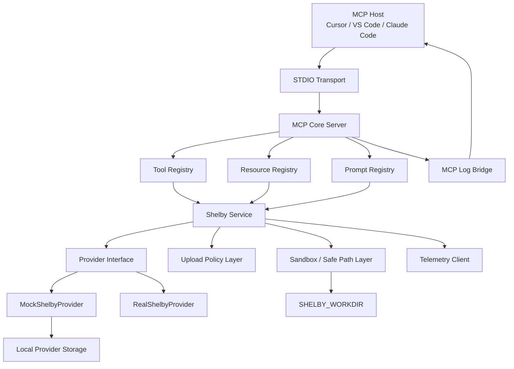
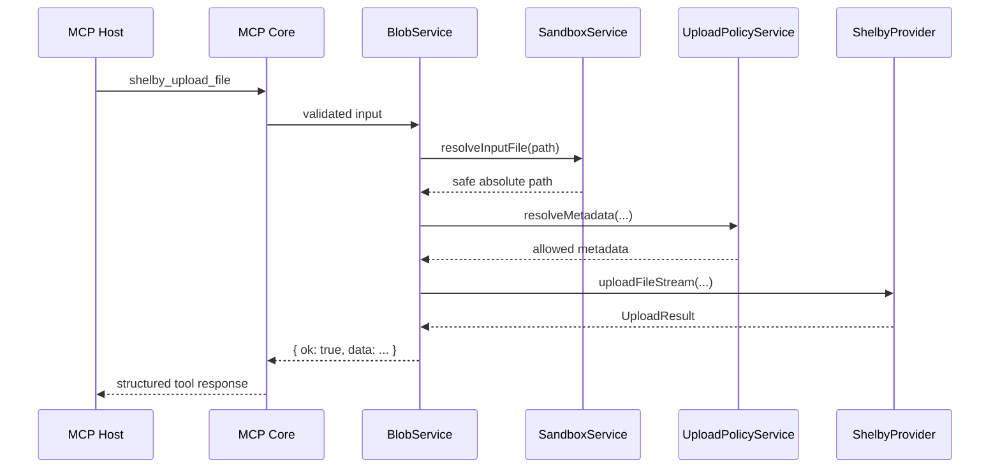

# shelby-mcp


**A local-first Shelby MCP server for AI agents that need safe, typed access to Shelby storage workflows.**

`shelby-mcp` is a backend/tooling-first repository, not a dashboard-first app. It gives MCP-compatible clients a serious Shelby integration surface with a strict filesystem sandbox, a fully working mock provider, an honest real-provider path, and an architecture that is ready to grow into HTTP transport, auth, media, and multi-user features later.

The MCP server, packages, docs, and tests live in the main repository structure. The static project website for [shelby-mcp.okwn.cc](https://shelby-mcp.okwn.cc) now lives in [`web-app/`](web-app/README.md) and can be deployed independently as a lightweight landing page for the repository.

> **Publish status**
>
> Ready to publish publicly as an experimental repository.
> Mock mode is mature and validated. Real provider mode is credible and implemented against the official Shelby SDK, but it is still experimental and not yet production-mature. CI is prepared for both Ubuntu and Windows, and the repo now includes an explicit real-provider smoke harness.

## Quick Start

Fastest path from clone to a working local MCP server:

```bash
npm install
npm run setup
npm run dev:mock
```

What this gives you:

- a `.env` file copied from `.env.example` only if you do not already have one
- a prepared `SHELBY_WORKDIR` sandbox
- initialized mock storage and temp directories
- a running STDIO MCP server backed by the mock provider

First things to inspect from your MCP client:

- `shelby_healthcheck`
- `shelby_get_safe_path_status`
- `shelby_get_upload_policy`
- `shelby://system/capabilities`
- `shelby://system/sandbox`

These commands are intentionally script-driven and cross-platform. The same `npm run ...` flow works in PowerShell, `cmd.exe`, Bash, Zsh, and most general Node.js environments.

## Repository Layout

This repository has two clear responsibilities:

- **Main project root:** the MCP server, shared packages, docs, tests, and CI configuration
- **`web-app/`:** the static landing page for [shelby-mcp.okwn.cc](https://shelby-mcp.okwn.cc)

The root repository remains the backend/tooling project. The website folder exists to provide a fast project overview, quick-start reference, update log, and an external sharing surface before or alongside formal Shelby ecosystem review.

## Project Website

The public-facing landing page lives in [`web-app/`](web-app/README.md).

- **Deploy target:** [shelby-mcp.okwn.cc](https://shelby-mcp.okwn.cc)
- **Purpose:** lightweight project website for the GitHub repository
- **Deployment model:** independent static deployment, separate from the MCP server runtime

Moving the website into `web-app/` keeps the repository root focused on the actual MCP server, provider layer, sandbox model, and developer tooling.

## What This Is

`shelby-mcp` exposes Shelby storage workflows through MCP tools, resources, and prompts so AI agents can:

- inspect provider/account state
- inspect active sandbox and upload policy
- upload files, text, and JSON
- list blobs and fetch metadata
- download blobs safely to local paths
- read text blobs with truncation
- verify blobs against local files

The repository is intentionally local-first:

- **Transport today:** STDIO
- **Primary runtime today:** mock provider
- **Extension path later:** HTTP/Streamable HTTP, auth/session, dashboard, media, org/team support

## Why This Exists

Shelby needs a serious MCP-native integration surface that is:

- safe enough to run locally around real files
- honest about mock vs real behavior
- easy for agents to understand without guesswork
- credible as a Shelby-adjacent developer tool

This repository exists to provide that foundation without collapsing transport, policy, provider logic, and filesystem access into one fragile server file.

## Why This Repo Feels Different

- **Strict sandbox by default:** every file path is scoped to `SHELBY_WORKDIR`, and the active scope can only narrow further.
- **Useful `shelby://system/*` resources:** agents can inspect capabilities, sandbox state, workflows, and upload policy before mutating anything.
- **Mock and real provider strategy:** local development is real and fully usable, while the real provider is explicit about what is and is not fully mature.
- **MCP-native design:** tools, resources, prompts, and client-visible logging are first-class features.
- **Future-ready layering:** STDIO is the supported runtime today, but the core business logic is not tied to a single transport.

## Key Features

- Fully working STDIO MCP server using the official MCP TypeScript SDK
- Strict `SHELBY_WORKDIR` sandbox with active safe-path narrowing
- Fully usable mock provider with local on-disk blob storage and SHA-256 checksums
- Real Shelby provider wired to `@shelby-protocol/sdk`
- Stream-aware file upload path with real streaming in mock mode
- Strict metadata mode for governed upload workflows
- Optional privacy-aware telemetry, disabled by default
- Structured logging to `stderr` plus MCP logging notifications
- 18 tools, 6 resources, and 5 prompts
- One-command setup and fast `dev:mock` onboarding

## How It Works

At runtime, the STDIO server composes config, logger, telemetry, provider selection, and the Shelby service layer. MCP registration is isolated from the business logic, and all file-based operations pass through the sandbox before they ever reach provider code.



Concrete upload request flow:



## Architecture Summary

Source layout:

```text
apps/
  server-stdio/
    src/index.ts

packages/
  mcp-core/
    src/server/
    src/tools/
    src/resources/
    src/prompts/
    src/logging/
    src/registry/
  shelby-service/
    src/provider/
    src/account/
    src/blob/
    src/media/
    src/sandbox/
    src/types/
    src/errors/
  shared/
    src/config/
    src/fs/
    src/logger/
    src/telemetry/
    src/utils/
    src/validation/

web-app/
  index.html
  styles.css
  README.md
```

Important entrypoints:

- [apps/server-stdio/src/index.ts](apps/server-stdio/src/index.ts)
- [packages/mcp-core/src/server.ts](packages/mcp-core/src/server.ts)
- [packages/mcp-core/src/tool-registry.ts](packages/mcp-core/src/tool-registry.ts)
- [packages/shelby-service/src/index.ts](packages/shelby-service/src/index.ts)
- [packages/shelby-service/src/sandbox/sandbox-service.ts](packages/shelby-service/src/sandbox/sandbox-service.ts)
- [packages/shelby-service/src/provider/mock-provider.ts](packages/shelby-service/src/provider/mock-provider.ts)
- [packages/shelby-service/src/provider/real-provider.ts](packages/shelby-service/src/provider/real-provider.ts)
- [web-app/index.html](web-app/index.html)
- [web-app/styles.css](web-app/styles.css)

More detail: [docs/architecture.md](docs/architecture.md)

## Security And Sandbox Highlights

This repository is not secure because it is "local." It is secure because the implementation treats filesystem access as a first-class boundary.

Security properties in the current implementation:

- every agent-visible file path is confined to `SHELBY_WORKDIR`
- the active safe path can be narrowed with `shelby_set_safe_path`
- the active scope cannot widen during runtime
- path traversal outside the root is rejected
- symlink escapes are rejected with real-path validation
- provider storage and temp internals are blocked from direct agent access
- destructive deletion is disabled unless `ALLOW_DESTRUCTIVE_TOOLS=true`
- strict metadata mode rejects uploads before the provider starts work
- telemetry is opt-in and sanitizes paths, metadata, and secrets
- client-visible log notifications redact absolute local paths
- logs go to `stderr`, not `stdout`, so STDIO protocol traffic is not corrupted

Why the sandbox matters:

- it reduces accidental data exposure to the model
- it prevents uploads/downloads from reaching arbitrary machine paths
- it gives users a way to intentionally narrow the blast radius of a session

More detail: [docs/security.md](docs/security.md)

## Mock Vs Real Provider

| Provider | Status       | What it is good for                                | Important limits                                                                         |
| -------- | ------------ | -------------------------------------------------- | ---------------------------------------------------------------------------------------- |
| `mock`   | Ready today  | local development, CI, tool validation, onboarding | local filesystem only, no real network semantics                                         |
| `real`   | Experimental | testing real Shelby list/upload/download flows     | uploads still buffer at the SDK boundary, no live CI coverage, not yet production-mature |

### Mock provider

`SHELBY_PROVIDER=mock` is the recommended first run.

It:

- stores blobs in local provider storage under `SHELBY_STORAGE_DIR`
- maintains a metadata index on disk
- computes SHA-256 checksums
- supports list, metadata, upload, batch upload, download, read text, verify, and delete
- implements true stream-based file uploads
- is deterministic enough for tests

### Real provider

`SHELBY_PROVIDER=real` is not a fake stub. It uses the official Shelby SDK and supports real Shelby operations where the SDK contract is clear.

What is implemented:

- list blobs
- get metadata
- upload and batch upload
- download
- read text
- verify by checksum comparison
- delete when signer credentials are configured
- derive direct retrieval URLs

What is still experimental:

- streaming uploads are accepted through the provider interface, but the current SDK adapter still buffers before submission
- batch upload failure reporting is less granular than the mock provider path
- live network validation is opt-in through a smoke harness rather than running in normal CI

## Quick Start In More Detail

### 1. Install

```bash
npm install
```

### 2. Prepare local defaults

```bash
npm run setup
```

### 3. Start the mock-backed server

```bash
npm run dev:mock
```

### 4. Or build and run the compiled server

```bash
npm run build
npm run start
```

## Environment Variables

Copy `.env.example` to `.env` or let `npm run setup` create `.env` for you.

| Variable                         | Default                  | Purpose                                                            |
| -------------------------------- | ------------------------ | ------------------------------------------------------------------ |
| `SHELBY_PROVIDER`                | `mock`                   | provider mode: `mock` or `real`                                    |
| `SHELBY_WORKDIR`                 | `.shelby-workdir`        | sandbox root                                                       |
| `SHELBY_STORAGE_DIR`             | `.shelby-system/storage` | internal storage path inside the sandbox root                      |
| `TEMP_DIR`                       | `.shelby-system/tmp`     | internal temp/download path inside the sandbox root                |
| `MAX_UPLOAD_SIZE_MB`             | `50`                     | upload size guardrail                                              |
| `MAX_READ_TEXT_BYTES`            | `65536`                  | text-read truncation limit                                         |
| `STREAM_UPLOAD_CHUNK_SIZE_BYTES` | `262144`                 | chunk size for stream-aware uploads                                |
| `SHELBY_STRICT_METADATA`         | `false`                  | enable strict upload metadata enforcement                          |
| `SHELBY_REQUIRED_METADATA_KEYS`  | empty                    | comma-separated required metadata keys                             |
| `SHELBY_DEFAULT_CONTENT_OWNER`   | empty                    | default metadata in non-strict mode                                |
| `SHELBY_DEFAULT_CLASSIFICATION`  | empty                    | default metadata in non-strict mode                                |
| `SHELBY_DEFAULT_SOURCE`          | empty                    | default metadata in non-strict mode                                |
| `TELEMETRY_ENABLED`              | `false`                  | opt-in anonymous telemetry                                         |
| `TELEMETRY_ENDPOINT`             | empty                    | telemetry destination                                              |
| `TELEMETRY_ENVIRONMENT`          | `development`            | telemetry environment label                                        |
| `TELEMETRY_SAMPLE_RATE`          | `1`                      | telemetry sampling ratio                                           |
| `ALLOW_DESTRUCTIVE_TOOLS`        | `false`                  | gate destructive operations                                        |
| `SHELBY_NETWORK`                 | `local`                  | real-provider network                                              |
| `SHELBY_ACCOUNT_ID`              | `demo-account`           | account context                                                    |
| `SHELBY_API_URL`                 | empty                    | optional Shelby RPC override                                       |
| `SHELBY_API_KEY`                 | empty                    | optional API key                                                   |
| `SHELBY_PRIVATE_KEY`             | empty                    | required for real-provider writes                                  |
| `SHELBY_REAL_SMOKE`              | `false`                  | opt-in live real-provider smoke step for `npm run test:real-smoke` |

## Cross-Platform Notes

The repository is designed so the normal developer flow stays shell-agnostic:

- use `npm run setup`
- use `npm run dev:mock`
- use `npm run build`
- use `npm test`

That avoids fragile inline env assignment in most cases.

When you do need a one-off environment override, the syntax differs by shell:

- Bash / Zsh: `SHELBY_REAL_SMOKE=true npm run test:real-smoke`
- PowerShell: `$env:SHELBY_REAL_SMOKE='true'; npm run test:real-smoke`
- `cmd.exe`: `set SHELBY_REAL_SMOKE=true && npm run test:real-smoke`

For MCP client configs:

- use POSIX-style absolute paths on macOS/Linux, for example `/Users/alex/dev/shelby-mcp/...`
- use escaped Windows paths on Windows, for example `C:\\Users\\alex\\dev\\shelby-mcp\\...`

## Cursor Integration

Cursor is a strong fit for `shelby-mcp` because this server is a **local STDIO MCP server**.

Why STDIO matters:

- Cursor starts the server as a local child process
- tool calls and structured responses travel over the MCP protocol on `stdout`
- server logs must stay on `stderr` so protocol traffic remains clean
- mock mode is the easiest way to validate the integration without any real Shelby credentials

Cursor configuration locations according to the current Cursor MCP docs:

- project config: `.cursor/mcp.json`
- global config: `~/.cursor/mcp.json`

Recommended flow:

```bash
npm install
npm run setup
npm run build
```

Example `.cursor/mcp.json`:

```json
{
  "mcpServers": {
    "shelby": {
      "type": "stdio",
      "command": "node",
      "args": ["/absolute/path/to/shelby-mcp/dist/apps/server-stdio/src/index.js"],
      "env": {
        "SHELBY_PROVIDER": "mock",
        "SHELBY_WORKDIR": "/absolute/path/to/your-project/.shelby-workdir",
        "SHELBY_STORAGE_DIR": ".shelby-system/storage",
        "TEMP_DIR": ".shelby-system/tmp",
        "ALLOW_DESTRUCTIVE_TOOLS": "false",
        "TELEMETRY_ENABLED": "false"
      }
    }
  }
}
```

Path note:

- macOS/Linux example path: `/Users/alex/dev/shelby-mcp/dist/apps/server-stdio/src/index.js`
- Windows example path: `C:\\Users\\alex\\dev\\shelby-mcp\\dist\\apps\\server-stdio\\src\\index.js`

What to test in Cursor:

1. Restart Cursor or reload the project after editing `mcp.json`.
2. Confirm the `shelby` server starts successfully.
3. Ask Cursor:
   - `Call shelby_healthcheck and summarize the active provider.`
   - `Read shelby://system/sandbox and tell me the current safe scope.`
   - `Show me the Shelby upload policy before uploading anything.`

If Cursor can call `shelby_healthcheck`, see the `shelby_*` tools, and access the system resources, the integration is working.

## VS Code Integration With `.vscode/mcp.json`

VS Code now supports MCP server configuration through `mcp.json`. For a shared project setup, use `.vscode/mcp.json`.

Build first:

```bash
npm install
npm run setup
npm run build
```

Example `.vscode/mcp.json`:

```json
{
  "servers": {
    "shelby": {
      "type": "stdio",
      "command": "node",
      "args": ["${workspaceFolder}/dist/apps/server-stdio/src/index.js"],
      "env": {
        "SHELBY_PROVIDER": "mock",
        "SHELBY_WORKDIR": "${workspaceFolder}/.shelby-workdir",
        "SHELBY_STORAGE_DIR": ".shelby-system/storage",
        "TEMP_DIR": ".shelby-system/tmp",
        "ALLOW_DESTRUCTIVE_TOOLS": "false",
        "TELEMETRY_ENABLED": "false"
      }
    }
  }
}
```

Notes:

- This keeps the sandbox root inside the workspace clone.
- The built entrypoint is used, which avoids requiring `tsx` inside VS Code.
- VS Code can optionally apply its own MCP sandboxing on macOS and Linux, but `shelby-mcp` already enforces an internal path guard regardless of host support.

How to validate in VS Code:

1. Open the Chat view and confirm the MCP server is started.
2. Run `MCP: List Servers` and verify that `shelby` is available.
3. Use the chat tool picker or tool configuration UI to confirm `shelby_*` tools are discovered.
4. Use `MCP: Browse Resources` to verify the `shelby://system/*` resources are available.
5. Try:
   - `Call shelby_healthcheck`
   - `Call shelby_get_safe_path_status`
   - `/shelby.onboard-account` if prompt discovery is enabled in your workflow

## Tool Catalog

| Tool                                  | Purpose                                                 |
| ------------------------------------- | ------------------------------------------------------- |
| `shelby_healthcheck`                  | provider and config sanity check                        |
| `shelby_capabilities`                 | machine-readable provider/runtime capabilities          |
| `shelby_account_info`                 | active provider, account, network, and status           |
| `shelby_get_upload_policy`            | upload limits, strict metadata state, streaming support |
| `shelby_get_safe_path_status`         | current sandbox root and active scope                   |
| `shelby_set_safe_path`                | narrow the active scope to a subdirectory               |
| `shelby_list_local_upload_candidates` | inspect local files before upload                       |
| `shelby_list_blobs`                   | list blobs                                              |
| `shelby_get_blob_metadata`            | inspect a blob                                          |
| `shelby_upload_file`                  | upload a local file                                     |
| `shelby_upload_text`                  | upload inline text                                      |
| `shelby_write_json`                   | serialize JSON and upload it                            |
| `shelby_download_blob`                | download a blob to a safe local path                    |
| `shelby_read_blob_text`               | read text safely with truncation                        |
| `shelby_get_blob_url`                 | derive a retrieval URL                                  |
| `shelby_batch_upload`                 | upload multiple files                                   |
| `shelby_verify_blob`                  | compare checksums / integrity                           |
| `shelby_delete_blob`                  | delete a blob when destructive tools are enabled        |

Full definitions: [docs/tool-spec.md](docs/tool-spec.md)

## Resource Catalog

| Resource                        | Purpose                                                          |
| ------------------------------- | ---------------------------------------------------------------- |
| `shelby://system/capabilities`  | provider mode, capabilities, transport, telemetry, upload policy |
| `shelby://system/account`       | account info and provider health                                 |
| `shelby://system/upload-policy` | strict metadata and upload constraints                           |
| `shelby://system/sandbox`       | root path, active scope, restrictions                            |
| `shelby://system/tools`         | machine-readable tool catalog                                    |
| `shelby://system/workflows`     | recommended safe operation sequences                             |

More detail: [docs/resources-prompts.md](docs/resources-prompts.md)

## Prompt Catalog

| Prompt                      | Purpose                                                          |
| --------------------------- | ---------------------------------------------------------------- |
| `onboard-account`           | inspect provider, capabilities, upload policy, and sandbox state |
| `prepare-batch-upload`      | inspect a directory and plan a batch upload                      |
| `safe-upload-file`          | safely upload one file and verify the result                     |
| `inspect-and-read-blob`     | inspect metadata before reading blob text                        |
| `verify-local-against-blob` | compare local and remote checksum state                          |

More detail: [docs/resources-prompts.md](docs/resources-prompts.md)

## Developer Scripts

| Script                    | What it does                                         |
| ------------------------- | ---------------------------------------------------- |
| `npm run setup`           | prepare `.env` and local directories                 |
| `npm run dev`             | run the STDIO server directly from TypeScript source |
| `npm run dev:mock`        | force mock mode and start with local-safe defaults   |
| `npm run build`           | compile to `dist/`                                   |
| `npm run start`           | run the compiled STDIO server                        |
| `npm test`                | run the Vitest suite                                 |
| `npm run test:real-smoke` | run the real-provider smoke harness                  |
| `npm run lint`            | run ESLint                                           |
| `npm run typecheck`       | run TypeScript without emit                          |
| `npm run format:check`    | verify Prettier formatting                           |
| `npm run check`           | format check, lint, typecheck, test, and build       |

## Real Provider Smoke Test

The repository includes a real-provider smoke harness in [tests/integration/real-provider-smoke.test.ts](tests/integration/real-provider-smoke.test.ts).

What it validates:

- the real provider factory path is active when `SHELBY_PROVIDER=real`
- capability reporting is honest
- account info and degraded health reporting work without live credentials
- a live healthcheck and list probe can be run explicitly against a real Shelby environment

Run the CI-safe smoke harness:

```bash
npm run test:real-smoke
```

That always exercises the real adapter path locally, even without network access.

To enable the live smoke step, provide real Shelby env vars and set `SHELBY_REAL_SMOKE=true`.

Minimum env needed for the live probe:

- `SHELBY_NETWORK`
- `SHELBY_ACCOUNT_ID`

Optional envs:

- `SHELBY_API_URL`
- `SHELBY_API_KEY`
- `SHELBY_PRIVATE_KEY`

Recommended cross-platform approach:

- put your real-provider values in `.env`
- temporarily set `SHELBY_REAL_SMOKE=true`
- run `npm run test:real-smoke`

Success means the provider can return account info, complete a healthcheck, and perform a minimal `listBlobs` probe. Failure means the real endpoint, account configuration, or credentials are not ready yet.

## Publish Readiness Checklist

Current public-publish checklist:

- [x] Mock provider works locally
- [x] `npm run setup` works
- [x] `npm run dev:mock` works
- [x] lint passes
- [x] typecheck passes
- [x] tests pass
- [x] build passes
- [x] CI covers Ubuntu and Windows
- [x] README reflects the current implementation
- [x] sandbox model is documented
- [x] destructive tools are gated
- [x] Cursor integration example exists
- [x] VS Code `.vscode/mcp.json` example exists
- [x] real-provider smoke harness exists
- [x] known limitations are documented
- [x] real provider is clearly labeled experimental
- [ ] live real-provider integration tests run in CI
- [ ] real-provider streaming is end-to-end

**Verdict:** ready to publish publicly as an experimental repository with noted limitations.

That is a good fit for public review today. It is **not** the same as "ready for official Shelby upstreaming without caveats."

## Upstream Readiness

What is stable enough for official review today:

- local STDIO runtime
- strict sandbox / safe-path model
- mock provider and local-first DX
- tool/resource/prompt surface
- config, logging, telemetry toggle, and strict metadata mode
- cross-platform scripts and CI expectations

What remains experimental:

- real-provider write maturity
- live Shelby validation outside an opt-in smoke run
- SDK-boundary streaming limitations

What likely still needs Shelby-native validation before a formal upstream merge request:

- broader real-network smoke coverage
- stronger confidence in real-provider upload behavior over time
- any Shelby-specific product expectations around signed URLs, auth, or hosted operation modes

## Current Status And Limitations

### Implemented now

- local STDIO runtime
- mock provider with real local workflows
- strict sandbox / safe-path model
- resources and prompts
- strict metadata mode
- telemetry toggle
- stream-aware upload path
- CI, lint, format, tests, setup scripts

### Experimental today

- real Shelby provider
- real-provider write operations
- telemetry in operator environments
- public positioning beyond experimental maturity

### Not yet implemented

- HTTP / Streamable HTTP transport
- dashboard/admin UI
- auth/session model
- wallet-aware user context
- richer media pipeline
- team/org support
- signed URLs

## Observability

The server emits structured Pino logs to `stderr` and can forward important warnings/errors to MCP clients through the logging bridge.

Examples:

- startup readiness
- provider warnings
- sandbox violations
- strict metadata denials
- destructive-tool denials
- real-provider failures

Telemetry is disabled by default. When enabled, it sends only coarse sanitized operational events. It does **not** send file contents, raw metadata, secrets, or raw absolute local paths.

More detail: [docs/observability.md](docs/observability.md)

## Example Agent Prompts

- `Inspect the Shelby environment and tell me what provider and safe path are active.`
- `Show me the current Shelby upload policy before I upload anything.`
- `Narrow the safe path to ./notes and upload todo.md to Shelby.`
- `List my Shelby blobs.`
- `Download blob X into a safe downloads directory.`
- `Read blob Y as text and tell me if it was truncated.`
- `Verify blob Z against ./documents/file.pdf.`
- `Plan a batch upload from ./artifacts before actually uploading anything.`

## Roadmap

Planned future phases:

- `apps/server-http` with HTTP / Streamable HTTP transport
- auth and session-aware account context
- wallet-aware user identity
- media processing and richer preparation tools
- team/org support
- dashboard/admin UI

Roadmap detail: [docs/roadmap.md](docs/roadmap.md)
