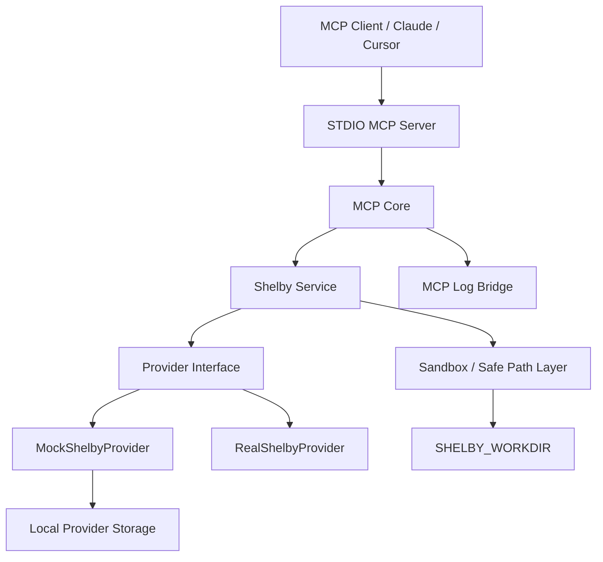

# shelby-mcp

`shelby-mcp` is a production-minded, local-first MCP server for AI agents that need safe access to Shelby storage workflows.

It is built as a backend/tooling-first repository for the Shelby ecosystem, not a dashboard-first app. The current MVP is STDIO-first, fully usable with a strong local mock provider, and intentionally structured so HTTP transport, auth, media, and org-aware features can be added later without rewriting the core layers.

## Quick Start

Fastest local path:

```powershell
npm.cmd install
npm.cmd run setup
npm.cmd run dev:mock
```

What that does:

- creates `.env` from `.env.example` only if it does not already exist
- prepares `SHELBY_WORKDIR`, local mock storage, and temp directories
- starts the STDIO MCP server with `SHELBY_PROVIDER=mock`

After startup, inspect:

- `shelby://system/sandbox`
- `shelby://system/upload-policy`
- `shelby://system/capabilities`

## Why This Exists

AI agents need a serious Shelby integration surface that is:

- safe to run locally
- honest about real versus mocked behavior
- structured for MCP-native tool use
- credible enough to upstream into a Shelby-adjacent organization repository

This repository provides that foundation with a strict filesystem sandbox, typed tool contracts, MCP resources/prompts, and a real-provider strategy built around the official Shelby TypeScript SDK.

## Why This Is Different

The repository is not just a thin MCP wrapper around storage calls.

- Strict path guard model: all local file operations stay confined to `SHELBY_WORKDIR`, and agents can only narrow scope further with `shelby_set_safe_path`.
- Meaningful `shelby://system/*` resources: clients can inspect capabilities, upload policy, sandbox state, and recommended workflows before mutating anything.
- Mock plus real provider strategy: local-first development is fully functional, while the real provider remains honest about capability gaps and SDK-boundary fallbacks.
- Future-ready layering: STDIO is the supported runtime now, but transport, policy, provider, and sandbox concerns are already separated for later HTTP work.

## MVP Scope

The current MVP includes:

- a fully working STDIO MCP server
- a layered monorepo-style architecture
- a strict `SHELBY_WORKDIR` filesystem sandbox with narrowing safe-scope support
- streaming file uploads in the mock provider and stream-aware upload adapters in the real provider path
- a fully working `MockShelbyProvider` for local development and CI
- a first-class `RealShelbyProvider` that uses [`@shelby-protocol/sdk`](https://www.npmjs.com/package/@shelby-protocol/sdk) where supported
- strict metadata mode for governed upload workflows
- opt-in anonymous error telemetry with privacy-preserving sanitization
- 18 MCP tools for account, sandbox, upload policy, blob, upload, download, verification, and deletion workflows
- dynamic MCP resources and prompts that help agents understand safe operating sequences
- structured terminal logging via Pino plus MCP logging notifications for important operational events
- CI, ESLint, Prettier, Vitest, and Changesets scaffolding for upstream-ready repository quality

## Features

- Local-first mock Shelby storage with on-disk metadata index and SHA-256 checksums
- Official Shelby SDK integration path for real network operations
- Stream-based file upload handling to reduce core memory pressure
- Strict path normalization, root scoping, and safe-path narrowing
- Strict metadata policy enforcement for uploads when enabled
- Strongly typed, JSON-friendly tool responses
- Destructive tool gating via `ALLOW_DESTRUCTIVE_TOOLS`
- Tool/resource/prompt registration isolated from transport concerns
- MCP logging bridge for client-visible warnings and errors
- Optional privacy-aware telemetry for failure patterns

## Architecture



Repository layout:

```text
apps/
  server-stdio/
    src/index.ts

packages/
  mcp-core/
    src/server/
    src/tools/
    src/resources/
    src/prompts/
    src/logging/
    src/registry/
  shelby-service/
    src/provider/
    src/account/
    src/blob/
    src/media/
    src/sandbox/
    src/types/
    src/errors/
  shared/
    src/config/
    src/fs/
    src/logger/
    src/utils/
    src/validation/

tests/
  integration/
  unit/

docs/
  architecture.md
  tool-spec.md
  resources-prompts.md
  security.md
  observability.md
  roadmap.md
```

Core implementation entrypoints:

- [apps/server-stdio/src/index.ts](apps/server-stdio/src/index.ts)
- [packages/mcp-core/src/server.ts](packages/mcp-core/src/server.ts)
- [packages/shelby-service/src/index.ts](packages/shelby-service/src/index.ts)
- [packages/shelby-service/src/provider/mock-provider.ts](packages/shelby-service/src/provider/mock-provider.ts)
- [packages/shelby-service/src/provider/real-provider.ts](packages/shelby-service/src/provider/real-provider.ts)

More detail is in [docs/architecture.md](docs/architecture.md).

## Security And Sandbox Model

All agent-visible filesystem operations are confined to `SHELBY_WORKDIR`.

The sandbox layer enforces:

- root confinement to `SHELBY_WORKDIR`
- active safe-scope narrowing via `shelby_set_safe_path`
- no widening beyond the configured root at runtime
- symlink escape rejection via real-path validation
- blocking access to internal provider/temp directories reserved for server internals

This means agents cannot use tool paths to read or write arbitrary machine paths outside the configured workspace root.

The relevant runtime surfaces are:

- [packages/shelby-service/src/sandbox/sandbox-service.ts](packages/shelby-service/src/sandbox/sandbox-service.ts)
- [packages/mcp-core/src/tools/sandbox-tools.ts](packages/mcp-core/src/tools/sandbox-tools.ts)

More detail is in [docs/security.md](docs/security.md).

## Mock Vs Real Provider

### Mock provider

`SHELBY_PROVIDER=mock` is the default and the primary local-development path. It:

- stores blobs in `SHELBY_STORAGE_DIR`
- persists an index on disk
- computes SHA-256 checksums
- streams file uploads directly into local provider storage with cleanup on partial failure
- supports list, metadata, upload, text upload, JSON upload, download, text reads, mock URLs, batch upload, verify, and delete
- behaves deterministically enough for unit and integration tests

### Real provider

`SHELBY_PROVIDER=real` is a real integration strategy, not a fake stub. It uses the official Shelby SDK and implements actual Shelby operations where the SDK contract is clear:

- list blobs
- fetch metadata
- upload
- batch upload
- download
- read text
- verify by checksum comparison
- delete, when signer configuration is present
- derive direct retrieval URLs

The real provider also accepts the new streaming upload interface, but it currently falls back to adapter-level buffering because the upstream Shelby SDK upload calls still expect in-memory blob payloads. That fallback is reported honestly through capability flags and runtime logs.

Write operations require:

- `SHELBY_PRIVATE_KEY`
- `SHELBY_ACCOUNT_ID`
- a valid Shelby network in `SHELBY_NETWORK`

If configuration or network support is incomplete, the provider reports degraded health and capability-gated errors rather than pretending the operation succeeded.

## Installation

Requirements:

- Node.js 20+
- npm 11+ recommended

Install dependencies:

```powershell
npm.cmd install
```

Bootstrap local defaults safely:

```powershell
npm.cmd run setup
```

## Environment Variables

Copy `.env.example` to `.env` and adjust as needed.

| Variable                         | Required | Default                  | Notes                                                                                 |
| -------------------------------- | -------- | ------------------------ | ------------------------------------------------------------------------------------- |
| `NODE_ENV`                       | no       | `development`            | `development`, `test`, `production`                                                   |
| `LOG_LEVEL`                      | no       | `info`                   | Pino log level                                                                        |
| `SHELBY_PROVIDER`                | no       | `mock`                   | `mock` or `real`                                                                      |
| `SHELBY_WORKDIR`                 | no       | `.shelby-workdir`        | Sandbox root for all agent-visible filesystem operations                              |
| `SHELBY_STORAGE_DIR`             | no       | `.shelby-system/storage` | Internal provider storage directory, resolved inside `SHELBY_WORKDIR`                 |
| `TEMP_DIR`                       | no       | `.shelby-system/tmp`     | Internal temp/download staging directory, resolved inside `SHELBY_WORKDIR`            |
| `SHELBY_NETWORK`                 | no       | `local`                  | Real-provider network; expected Shelby values include `local`, `testnet`, `shelbynet` |
| `SHELBY_ACCOUNT_ID`              | no       | `demo-account`           | Active account context                                                                |
| `SHELBY_API_URL`                 | no       | empty                    | Optional Shelby RPC override                                                          |
| `SHELBY_API_KEY`                 | no       | empty                    | Optional Shelby RPC API key                                                           |
| `SHELBY_PRIVATE_KEY`             | no       | empty                    | Required for real-provider write operations                                           |
| `MAX_UPLOAD_SIZE_MB`             | no       | `50`                     | Upload guardrail for file/text/JSON flows                                             |
| `MAX_READ_TEXT_BYTES`            | no       | `65536`                  | Safe truncation limit for `shelby_read_blob_text`                                     |
| `STREAM_UPLOAD_CHUNK_SIZE_BYTES` | no       | `262144`                 | Stream read chunk size for file uploads                                               |
| `SHELBY_STRICT_METADATA`         | no       | `false`                  | Reject uploads missing required metadata keys                                         |
| `SHELBY_REQUIRED_METADATA_KEYS`  | no       | empty                    | Comma-separated metadata keys required when strict mode is enabled                    |
| `SHELBY_DEFAULT_CONTENT_OWNER`   | no       | empty                    | Default metadata value applied in non-strict mode                                     |
| `SHELBY_DEFAULT_CLASSIFICATION`  | no       | empty                    | Default metadata value applied in non-strict mode                                     |
| `SHELBY_DEFAULT_SOURCE`          | no       | empty                    | Default metadata value applied in non-strict mode                                     |
| `TELEMETRY_ENABLED`              | no       | `false`                  | Opt-in anonymous error telemetry                                                      |
| `TELEMETRY_ENDPOINT`             | no       | empty                    | HTTPS endpoint for telemetry delivery                                                 |
| `TELEMETRY_ENVIRONMENT`          | no       | `development`            | Environment label sent with telemetry events                                          |
| `TELEMETRY_SAMPLE_RATE`          | no       | `1`                      | Sampling rate between `0` and `1`                                                     |
| `ALLOW_DESTRUCTIVE_TOOLS`        | no       | `false`                  | Must be `true` to enable delete                                                       |

## Running Locally

Development server:

```powershell
npm.cmd run dev
```

Mock-first development server with safe defaults:

```powershell
npm.cmd run dev:mock
```

Typecheck:

```powershell
npm.cmd run typecheck
```

Lint:

```powershell
npm.cmd run lint
```

Build:

```powershell
npm.cmd run build
```

Run the built STDIO server:

```powershell
npm.cmd run start
```

Run tests:

```powershell
npm.cmd test
```

Run the full repo-quality check locally:

```powershell
npm.cmd run check
```

## Connecting From An MCP Client

Build the project first, then point the client at the compiled STDIO entrypoint.

Example JSON config:

```json
{
  "mcpServers": {
    "shelby": {
      "command": "node",
      "args": ["dist/apps/server-stdio/src/index.js"],
      "cwd": "C:\\Users\\Nida Bil\\Desktop\\shelby-mcp",
      "env": {
        "SHELBY_PROVIDER": "mock",
        "SHELBY_WORKDIR": ".shelby-workdir",
        "ALLOW_DESTRUCTIVE_TOOLS": "false"
      }
    }
  }
}
```

For development-time TypeScript execution:

```json
{
  "mcpServers": {
    "shelby-dev": {
      "command": "npm.cmd",
      "args": ["run", "dev"],
      "cwd": "C:\\Users\\Nida Bil\\Desktop\\shelby-mcp",
      "env": {
        "SHELBY_PROVIDER": "mock"
      }
    }
  }
}
```

## Tool Catalog

The current server exposes 18 tools:

1. `shelby_healthcheck`
2. `shelby_capabilities`
3. `shelby_account_info`
4. `shelby_get_upload_policy`
5. `shelby_get_safe_path_status`
6. `shelby_set_safe_path`
7. `shelby_list_local_upload_candidates`
8. `shelby_list_blobs`
9. `shelby_get_blob_metadata`
10. `shelby_upload_file`
11. `shelby_upload_text`
12. `shelby_write_json`
13. `shelby_download_blob`
14. `shelby_read_blob_text`
15. `shelby_get_blob_url`
16. `shelby_batch_upload`
17. `shelby_verify_blob`
18. `shelby_delete_blob`

Detailed definitions are in [docs/tool-spec.md](docs/tool-spec.md).

## Resources Catalog

Dynamic MCP resources:

- `shelby://system/capabilities`
- `shelby://system/account`
- `shelby://system/upload-policy`
- `shelby://system/sandbox`
- `shelby://system/tools`
- `shelby://system/workflows`

See [docs/resources-prompts.md](docs/resources-prompts.md).

## Prompts Catalog

Built-in MCP prompts:

- `onboard-account`
- `prepare-batch-upload`
- `safe-upload-file`
- `inspect-and-read-blob`
- `verify-local-against-blob`

See [docs/resources-prompts.md](docs/resources-prompts.md).

## Observability

The server logs to `stderr` using Pino and can also emit MCP logging messages to connected clients for important warnings and operational issues.

Examples include:

- startup status
- provider initialization warnings
- sandbox violations
- strict metadata policy rejections
- destructive-tool denials
- real-provider failures

Optional telemetry is disabled by default. When enabled, it reports coarse failure events and one startup capability snapshot without sending secrets, raw absolute paths, file contents, or raw metadata payloads.

The logging bridge lives in [packages/mcp-core/src/logging/mcp-log-bridge.ts](packages/mcp-core/src/logging/mcp-log-bridge.ts). More detail is in [docs/observability.md](docs/observability.md).

## Repo Standards

This repository includes:

- GitHub Actions CI in [.github/workflows/ci.yml](.github/workflows/ci.yml)
- ESLint via [eslint.config.js](eslint.config.js)
- Prettier via [.prettierrc](.prettierrc)
- EditorConfig via [.editorconfig](.editorconfig)
- Changesets via [.changeset/config.json](.changeset/config.json)

Recommended commit format:

- `feat: add signed-url capability reporting`
- `fix: reject sandbox symlink escape`
- `docs: expand real provider configuration`

## Example Agent Prompts

- `Inspect the Shelby environment and tell me what provider and safe path are active.`
- `Show me the active Shelby upload policy before I upload anything.`
- `Narrow the safe path to ./notes and upload todo.md to Shelby.`
- `If strict metadata mode is enabled, tell me which metadata keys I must provide.`
- `List my Shelby blobs.`
- `Download blob X into a safe downloads directory.`
- `Read blob Y as text and tell me if the result was truncated.`
- `Verify blob Z against ./documents/file.pdf.`
- `Plan a batch upload from ./artifacts before actually uploading.`

## Roadmap

Planned future phases include:

- `apps/server-http` with Streamable HTTP transport
- auth and session-aware account context
- wallet-aware user identity
- media processing and richer file preparation
- team and org support
- dashboard/admin UI

See [docs/roadmap.md](docs/roadmap.md).
