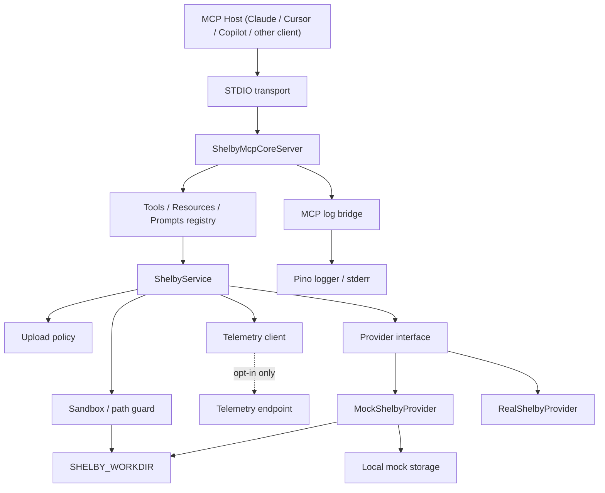
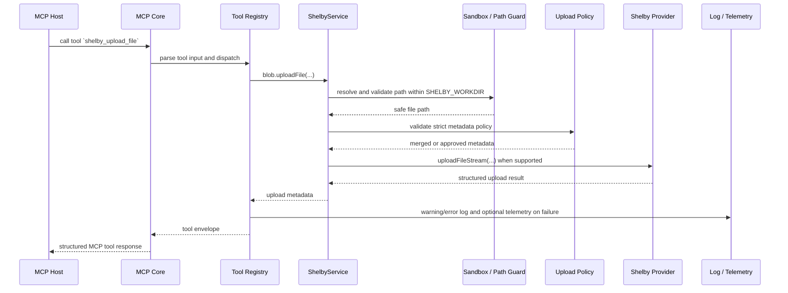

# Architecture

## Design Goals

`shelby-mcp` is intentionally:

- local-first
- STDIO-first
- transport-agnostic at the core
- strict about filesystem scope
- honest about provider capability gaps

The repository is built so the first supported runtime is a serious local MCP server, while future HTTP transport can reuse the same domain and MCP registration layers.

## System Diagram

## Layered Design

### 1. Transport runtime

[apps/server-stdio/src/index.ts](../apps/server-stdio/src/index.ts) is the executable entrypoint.

Responsibilities:

- load validated config
- create the shared logger
- create the telemetry client
- construct the provider and service layer
- initialize sandbox state
- attach the MCP core to STDIO transport

This file is intentionally thin so future `apps/server-http` work stays additive rather than invasive.

### 2. MCP core

[packages/mcp-core/src/server.ts](../packages/mcp-core/src/server.ts) owns MCP SDK integration.

Responsibilities:

- tool registration
- resource registration
- prompt registration
- transport-agnostic MCP server construction
- MCP logging bridge attachment

[packages/mcp-core/src/tool-registry.ts](../packages/mcp-core/src/tool-registry.ts) executes validated tools directly, which keeps integration tests transport-light.

### 3. MCP logging bridge

[packages/mcp-core/src/logging/mcp-log-bridge.ts](../packages/mcp-core/src/logging/mcp-log-bridge.ts) maps internal log events onto MCP logging notifications when a client is connected.

This separates transport-safe observability concerns from the shared logger and from business logic.

### 4. Telemetry layer

[packages/shared/src/telemetry/index.ts](../packages/shared/src/telemetry/index.ts) provides a separate telemetry abstraction with:

- `NoopTelemetryClient` for the default disabled mode
- `HttpTelemetryClient` for opt-in delivery
- payload sanitization that strips raw paths, raw metadata, and secrets

Telemetry is intentionally separated from logging so operators can enable coarse anonymous failure reporting without coupling it to terminal logs or MCP notifications.

### 5. Shelby service layer

[packages/shelby-service/src/index.ts](../packages/shelby-service/src/index.ts) composes the domain services.

Responsibilities:

- account and health workflows
- blob orchestration
- upload policy enforcement
- size and safety checks
- destructive-tool gating
- safe sandbox path resolution before filesystem access

This is the main business-logic layer that future transports should reuse.

### 6. Provider abstraction

[packages/shelby-service/src/types/index.ts](../packages/shelby-service/src/types/index.ts) defines the provider contract and stable JSON-friendly domain models:

- `BlobSummary`
- `BlobMetadata`
- `AccountInfo`
- `ProviderCapabilities`
- `NetworkInfo`
- `DownloadResult`
- `VerificationResult`
- `SafePathInfo`
- `SandboxStatus`
- `UploadPolicy`

Provider implementations:

- [packages/shelby-service/src/provider/mock-provider.ts](../packages/shelby-service/src/provider/mock-provider.ts)
- [packages/shelby-service/src/provider/real-provider.ts](../packages/shelby-service/src/provider/real-provider.ts)

The goal is to keep Shelby concepts stable even if the underlying official SDK evolves.

Streaming uploads are modeled at the provider boundary through an additive file-stream upload path. The mock provider implements true stream-to-disk behavior. The real provider accepts the same interface but honestly reports that the current SDK adapter still buffers at submission time.

### 7. Sandbox layer

[packages/shelby-service/src/sandbox/sandbox-service.ts](../packages/shelby-service/src/sandbox/sandbox-service.ts) is a first-class boundary, not an optional helper.

Responsibilities:

- initialize `SHELBY_WORKDIR`, storage, and temp directories
- enforce root scoping
- allow only safe-path narrowing
- block direct access to reserved internal directories
- reject symlink escapes with real-path checks
- resolve safe download/output targets

All tool-level filesystem activity is routed through this service.

### 8. Shared infrastructure

[packages/shared/src/config/index.ts](../packages/shared/src/config/index.ts) validates environment configuration and rejects unsafe storage/temp paths that would escape `SHELBY_WORKDIR`.

[packages/shared/src/logger/index.ts](../packages/shared/src/logger/index.ts) provides structured logging, sink fan-out, and sensitive-field redaction.

[packages/shared/src/fs/index.ts](../packages/shared/src/fs/index.ts) contains reusable filesystem helpers such as hashing, directory creation, candidate listing, and path-inside-root checks.

[packages/shelby-service/src/blob/upload-policy.ts](../packages/shelby-service/src/blob/upload-policy.ts) centralizes metadata policy enforcement so strict metadata mode applies consistently to file, text, JSON, and batch uploads.

## Why STDIO First

STDIO is the fastest path to a useful Shelby MCP server for:

- Claude Code
- Cursor
- local agent runners
- CI-driven MCP smoke tests

Starting with STDIO avoids premature complexity around:

- HTTP auth
- hosted multi-user session models
- deployment infrastructure
- request-scoped tenancy

The repository proves the Shelby tool contract and local safety model first.

## Real Provider Strategy

The real provider is not modeled as a vague future adapter. It already uses the official Shelby Node SDK and Aptos signer tooling where the current integration path is clear.

Current implementation characteristics:

- official SDK-backed read and write operations where configuration is sufficient
- stream-aware upload adapters with honest capability reporting
- capability flags derived from actual runtime config
- degraded health reporting when network/account/signer prerequisites are missing
- explicit provider errors instead of silent fake success

This keeps the repo credible for upstream evolution while preserving a fully functional local mock path.

## Resources And Prompts

Resources and prompts are kept beside tools in `packages/mcp-core` because they are part of the MCP contract, not part of Shelby business logic.

Resources help agents inspect current state before mutating anything.

Prompts teach intended tool sequences such as:

- onboarding
- safe upload
- batch upload planning
- upload-policy inspection before mutation
- metadata-first text reads
- local-versus-remote verification

## HTTP Transport Path

A future `apps/server-http` can reuse:

- `ShelbyService`
- `SandboxService`
- provider implementations
- `ToolRegistry`
- `ShelbyMcpCoreServer`

The main new work should be:

- HTTP transport adapter
- auth/session middleware
- per-request account and user resolution
- deployment-specific observability and policy controls

That is why transport setup stays thin and core MCP registration stays reusable.

## Request Flow

Concrete upload path for `shelby_upload_file`:

In the happy path, the request stays inside the sandbox and the provider returns typed metadata. If metadata policy fails, sandbox validation fails, or the provider returns an operational error, the tool response stays structured and the logger emits the failure safely; telemetry only emits if explicitly enabled.
